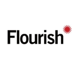

In our capacity building work we teach and use multiple tools:

[**Flourish**](https://flourish.studio/),  new platform for visualizing, presenting and telling stories with data.
Currently [Flourish partners with Google News Lab](https://flourish.studio/newsrooms/) to make Floursh available for journalists. Floursih is available among [Google News Initiative tools](https://pbs.twimg.com/profile_images/927560296721453059/NwEYJgOE_400x400.jpg). 
In our opinion, Flourish is easy to pick, intuitive, beautiful, and free - a perfect combination for teaching local communities new data literacy skills. 

[**R**](https://www.r-project.org/) - a programming language and free software environment for statistical computing and graphics. The R language is widely used among statisticians and data miners for developing statistical software and data analysis.

[**Shiny**](https://www.rstudio.com/products/shiny/) - an open source R package that provides an elegant and powerful web framework for building web applications using R. Shiny helps to turn the analyses into interactive web applications without requiring HTML, CSS, or JavaScript knowledge. It allows to host standalone apps on a webpage or embed them in R Markdown documents or build dashboards. 

